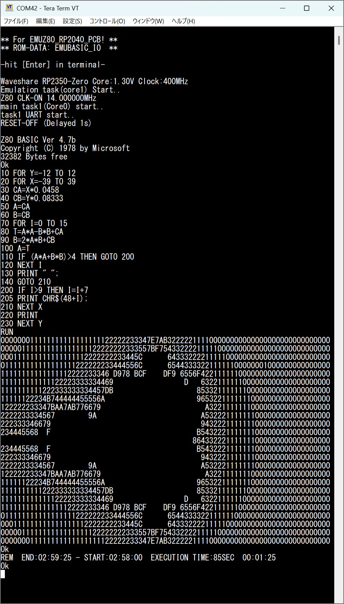

# EMUZ80_RP2040_PCB_Firmware (RP2350-Zero Version)

@tendai22plus氏作の [EMUZ80_RP2040_PCB](https://github.com/tendai22/EMUZ80_RP2040_PCB) 基板用のファームウェアです。  
EMUZ80_RP2040は実物の Z80 CPU を RP2040 または RP2350 搭載ボードで動かすための周辺回路・バスエミュレータ。 
ソフトウェアでCPU自体をエミュレーションするのではなく、RP2040/RP2350 の PIO (プログラマブル I/O) サブシステムを利用してメモリや I/O デバイスをエミュレートし、本物の Z80 マイクロプロセッサを動作させます。

github -> https://github.com/tendai22/EMUZ80_RP2040_PCB

## 対応RP2040/RP2350ボード
- AE-RP2040_EMUZ80 (秋月電子 AE-RP2040) - [AE-RP2040ブランチはこちら](https://github.com/kyo-ta04/EMUZ80_RP2040_PCB_Firmware/tree/AE-RP2040)
- Waveshare RP2350-Zero_EMUZ80 (Waveshare RP2350-Zero) - [RP2350-Zeroブランチはこちら](https://github.com/kyo-ta04/EMUZ80_RP2040_PCB_Firmware/tree/RP2350-Zero)
- WeAct RP2350B CoreBoard_EMUZ80 (WeAct RP2350B CoreBoard)

### ビルド済み UF2 ファイル
すぐに書き込んで試せるUF2ファイルをuf2フォルダに用意しています。
- `EMUZ80_RP2040_xxMHz.uf2` — 秋月電子 AE-RP2040 用 （xxMHz=Z80の動作クロック）
- `EMUZ80_RP2350-Zero_xxMHz.uf2` — Waveshare RP2350-Zero 用 （xxMHz=Z80の動作クロック）
- ** RP2350B は順次追加していく予定です **

## 通信端末ソフトの注意

TeraTerm 等の通信端末ソフトから文字を送る際は **送信遅延（文字遅延・行遅延）を設定しないと文字の取りこぼしや誤動作が発生する場合があります**。

## ビルド要件
- Antigravity IDE (推奨ビルド環境)
- Raspberry Pi Pico C/C++ SDK
- CMake

## ビルド方法

現在、本プロジェクトのビルドおよび動作確認は **Antigravity IDE** 上でのみ行われています。

*(注: 通常の CMake/Ninja を用いたビルドも理論上は可能ですが、公式にはサポート（テスト）していません)*

## 既知の問題 (Known Issues)

- **動作クロックとビルド構成について**
  - Z80 の動作クロックを上げる場合（例：Z80 10MHzなど）、ビルド構成を **`Release`** に設定する必要があります。`Debug` ビルドでは最適化が不足し、高速動作に追従できず正常に動作しません。
- **高速動作のための必須設定**
  - Z80 の高速動作には、`CMakeLists.txt` にて以下の設定が有効である必要があります。
    - **`copy_to_ram` (RAM実行)**: RP2040 を高速で動作させる際、Flash メモリからの読み出し速度制限を回避するため。
    - **`-O3` (最大最適化)**: Z80 バスエミュレーションループの処理能力を確保するため。

## 謝辞 (Acknowledgments)

本プロジェクトでは、[EMUZ80 プロジェクト](https://vintagechips.wordpress.com/2022/03/05/emuz80_reference/) の **ROM-BASIC (EMUBASIC)** を利用させていただいています。

含まれている EMUBASIC は、**Grant Searle 氏の NASCOM BASIC** をベースにしています。この歴史的な素晴らしいソフトウェアを利用可能にしてくださった Grant Searle 氏 (http://searle.x10host.com/) と、EMUZ80 プロジェクトを通じて EMUBASIC を提供・公開してくださった vintagechips 氏、そして、[emuz80_pico2](https://github.com/tendai22/emuz80_pico2) でパッチを当てて**EMUBASIC_IO**を公開してくださった [@tendai22plus氏](https://github.com/tendai22) ([x.com](https://x.com/tendai22plus)) に深く感謝いたします。

## ライセンス (License)

このプロジェクト自体は **MIT ライセンス**の下で公開されています。詳細は `LICENSE` ファイルを確認してください。

**重要な例外 (ROM-BASIC について):**
ソースコード (`emubasic_io.h`) に含まれる ROM-BASIC (`emuz80_binary`) は、Grant Searle 氏および EMUZ80、emuz80_pico2 プロジェクトの著作物に基づいています。
- Grant Searle 氏のコードは **「非商用利用 (NON-COMMERCIAL USE ONLY)」** に限定されています。
- EMUZ80 の関連資料は通常 **CC BY-NC-SA 3.0** 等の非商用ライセンスで提供されています。
従って、組み込まれている ROM-BASIC 部分のコードには上記の非商用制限が適用され、この部分については **MIT ライセンスの適用外** となりますのでご注意ください。

## ギャラリー
### 実行結果

### 回路図

### 基板裏面

** BUSRQ,INT,NMI,WAITはプルアップ、RESETの LEDもジャンパで接続 **
