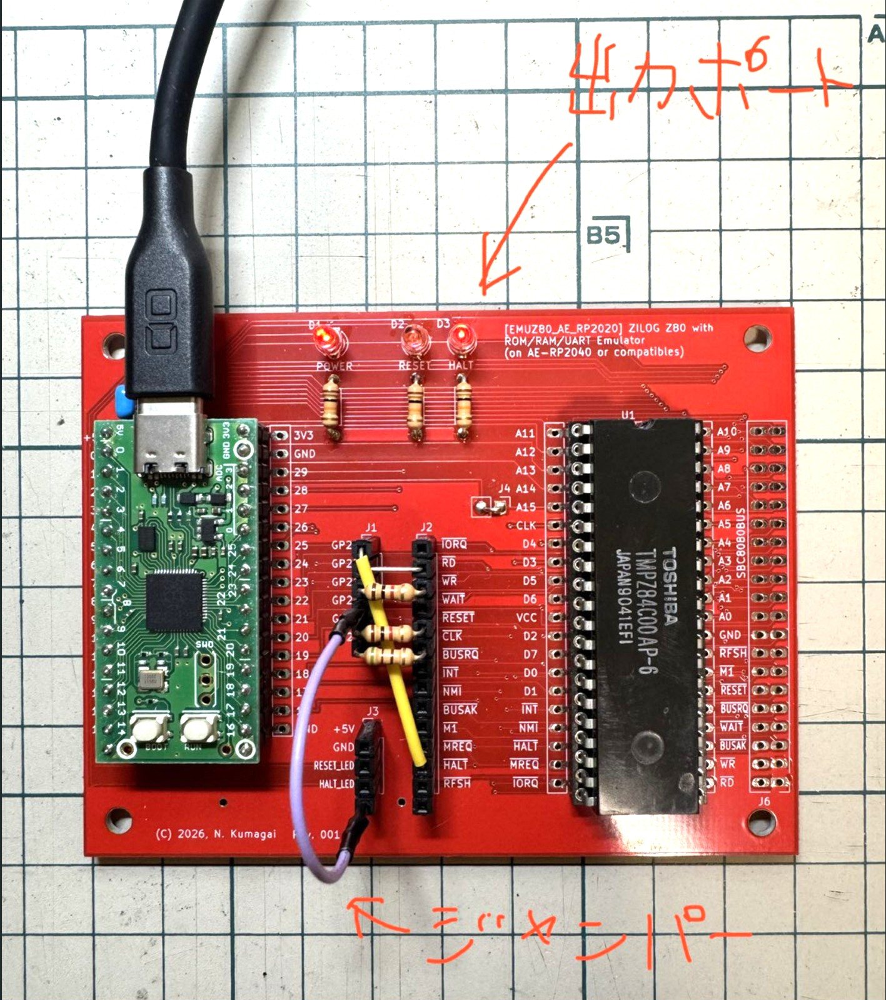
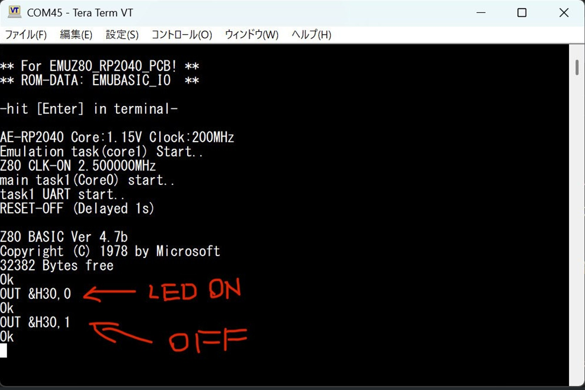
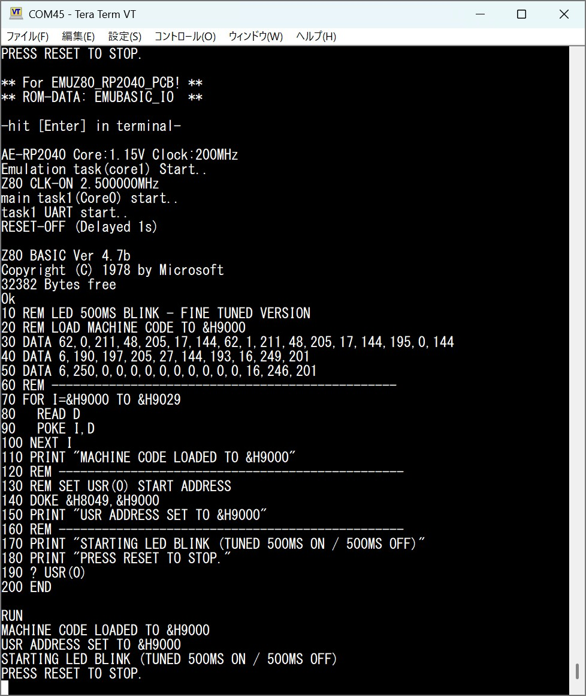
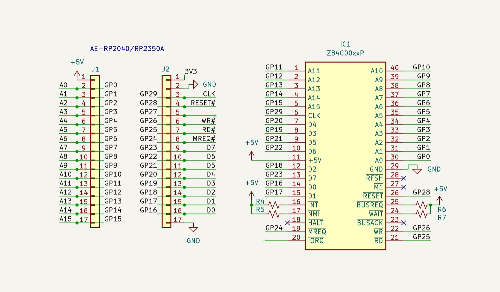
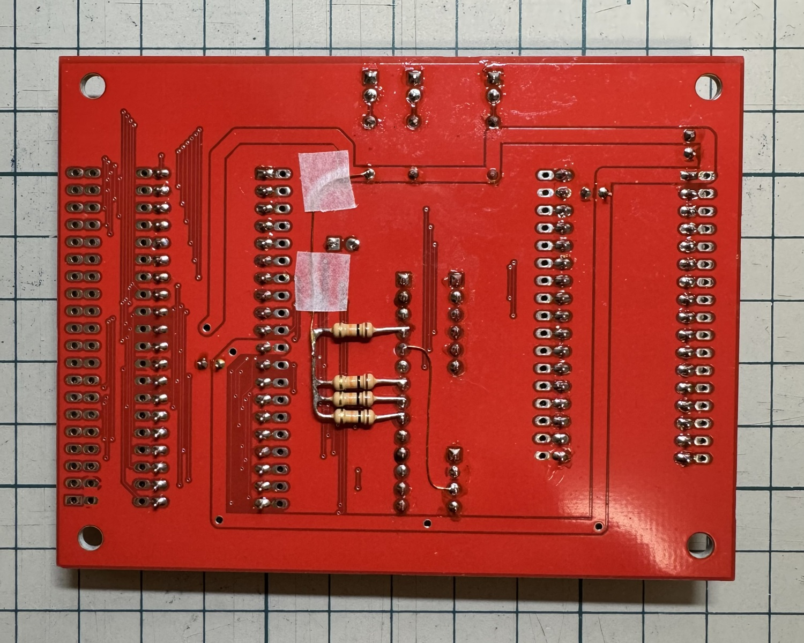

# EMUZ80_RP2040_PCB_Firmware(AE-RP2040_LChika Branch)


## LChika Branch(Lチカブランチ)
WAIT信号を使わずに空いているGPIO27を仮想出力ポートに割り当て。
基板上でHALT-LEDとGPIO27をジャンパーで接続、
Lowで点灯、Hiで消灯するようにしてあります。  
Z80のアセンブラ（マシン語）で約500ms間隔でLEDを点滅させるプログラムを作り、
BASICからマシン語ルーチンをメモリに書込んでUSR関数で呼び出して動かしています。

アセンブラプログラム
```
9000  3E 00        LD   A,00H         ; LED ON (bit0=0)
9002  D3 30        OUT  (30H),A
9004  CD 11 90     CALL delay500      ; 約500ms delay
9007  3E 01        LD   A,01H         ; LED OFF (bit0=1)
9009  D3 30        OUT  (30H),A
900B  CD 11 90     CALL delay500
900E  C3 00 90     JP   9000H         ; 無限ループ

9011  06 BC        LD   B,188         ; B=188 (delay500開始)
9013  C5           PUSH BC            ; B退避
9014  CD 1B 90     CALL delay2ms      ; delay2ms呼び出し
9017  C1           POP  BC            ; B復帰
9018  10 F9        DJNZ 9013H
901A  C9           RET

901B  06 FA        LD   B,0FAH        ; B=250 (delay2ms開始)            7T
901D  00           NOP                ; 遅延調整                         4T
901E  00           NOP                ; 遅延調整                         4T
901F  00           NOP                ; 遅延調整                         4T
9020  00           NOP                ; 遅延調整                         4T
9021  00           NOP                ; 遅延調整                         4T
9022  00           NOP                ; 遅延調整                         4T
9023  00           NOP                ; 遅延調整                         4T
9024  00           NOP                ; 遅延調整                         4T
9025  00           NOP                ; 遅延調整                         4T
9026  10 F5        DJNZ 901DH         ; 空ループ（正しい相対アドレス）   13T/8T
9028  C9           RET                ; delay2ms終了   
```

BASIC プログラム(DATA文でマシン語組込済)
```
10 REM LED 500ms blink
20 REM Load machine code to &H9000
30 DATA 62,0,211,48,205,17,144,62,1,211,48,205,17,144,195,0,144
40 DATA 6,188,197,205,27,144,193,16,249,201
50 DATA 6,250,0,0,0,0,0,0,0,0,0,16,245,201
60 REM ------------------------------------------------
70 FOR I=&H9000 TO &H9028
80   READ D
90   POKE I,D
100 NEXT I
110 PRINT "Machine code loaded to &H9000"
120 REM ------------------------------------------------
130 REM Set USR(0) start address
140 DOKE &H8049,&H9000
150 PRINT "USR address set to &H9000"
160 REM ------------------------------------------------
170 PRINT "Starting LED blink (~500ms ON / 500ms OFF)"
180 PRINT "Press RESET to stop."
190 ? USR(0)
200 END
```


## EMUZ80_RP2040_PCB_Firmware
@tendai22plus氏作の [EMUZ80_RP2040_PCB](https://github.com/tendai22/EMUZ80_RP2040_PCB) 基板用のファームウェアです。  
EMUZ80_RP2040は実物の Z80 CPU を RP2040 または RP2350 搭載ボードで動かすための周辺回路・バスエミュレータ。 
ソフトウェアでCPU自体をエミュレーションするのではなく、RP2040/RP2350 の PIO (プログラマブル I/O) サブシステムを利用してメモリや I/O デバイスをエミュレートし、本物の Z80 マイクロプロセッサを動作させます。

github -> https://github.com/tendai22/EMUZ80_RP2040_PCB

**注意：**
- 2026/3/22追記： GPIO26(RD#)を入力に使用してたため保護抵抗を入れました、GPIO28,20(RESET#,CLK)は出力ですが念のため保護抵抗を入れました。

## 対応RP2040/RP2350ボード
- 秋月電子 AE-RP2040 - [AE-RP2040ブランチはこちら](https://github.com/kyo-ta04/EMUZ80_RP2040_PCB_Firmware/tree/AE-RP2040)
- Waveshare RP2350-Zero - [RP2350-Zeroブランチはこちら](https://github.com/kyo-ta04/EMUZ80_RP2040_PCB_Firmware/tree/RP2350-Zero)
- WeAct Studio RP2350B CoreBoard - [RP2350B CoreBoardブランチはこちら](https://github.com/kyo-ta04/EMUZ80_RP2040_PCB_Firmware/tree/RP2350B_CoreBoard)

### ビルド済み UF2 ファイル
すぐに書き込んで試せるUF2ファイルをuf2フォルダに用意しています。
- `EMUZ80_RP2040_xxMHz.uf2` — 秋月電子 AE-RP2040 用 （xxMHz=Z80の動作クロック）
- `EMUZ80_RP2350-Zero_xxMHz.uf2` — Waveshare RP2350-Zero 用 （xxMHz=Z80の動作クロック）
- `EMUZ80_RP2350B_Core_xxMHz.uf2` — WeAct RP2350B CoreBoard 用 （xxMHz=Z80の動作クロック）

## 通信端末ソフトの注意

TeraTerm 等の通信端末ソフトから文字を送る際は **送信遅延（文字遅延・行遅延）を設定しないと文字の取りこぼしや誤動作が発生する場合があります**。

## ビルド要件
- Antigravity IDE (推奨ビルド環境)
- Raspberry Pi Pico C/C++ SDK
- CMake

## ビルド方法

現在、本プロジェクトのビルドおよび動作確認は **Antigravity IDE** 上でのみ行われています。

*(注: 通常の CMake/Ninja を用いたビルドも理論上は可能ですが、公式にはサポート（テスト）していません)*

## 既知の問題 (Known Issues)

- **動作クロックとビルド構成について**
  - Z80 の動作クロックを上げる場合（例：Z80 10MHzなど）、ビルド構成を **`Release`** に設定する必要があります。`Debug` ビルドでは最適化が不足し、高速動作に追従できず正常に動作しません。
- **高速動作のための必須設定**
  - Z80 の高速動作には、`CMakeLists.txt` にて以下の設定が有効である必要があります。
    - **`copy_to_ram` (RAM実行)**: RP2040 を高速で動作させる際、Flash メモリからの読み出し速度制限を回避するため。
    - **`-O3` (最大最適化)**: Z80 バスエミュレーションループの処理能力を確保するため。

## ⚠ GPIO 5V トレラント接続に関する注意

本プロジェクトでは、RP2040/RP2350 の GPIO ピン (3.3V I/O) を Z80 バス (5V系) に**直接接続**しています。  
RP2040/RP2350 の GPIO は公式には **5V トレラントではありません**。  
Raspberry Pi 公式のデータシートでは、GPIO 入力電圧の絶対最大定格は **IOVDD + 0.5V（= 約 3.8V）** と規定されています。

### リスクと免責

> [!CAUTION]
> **この接続方法はデータシートの定格範囲外の使用です。**  
> - RP2040/RP2350 チップの**長期的な信頼性低下や寿命短縮**の可能性があります
> - 個体差や温度条件によっては **動作不良やチップ破損** が発生する可能性を否定できません

本プロジェクトの回路構成で発生した損害について、開発者は一切の責任を負いません。使用に際しては自己責任でお願いします。

## 謝辞 (Acknowledgments)

本プロジェクトでは、[EMUZ80 プロジェクト](https://vintagechips.wordpress.com/2022/03/05/emuz80_reference/) の **ROM-BASIC (EMUBASIC)** を利用させていただいています。

含まれている EMUBASIC は、**Grant Searle 氏の NASCOM BASIC** をベースにしています。この歴史的な素晴らしいソフトウェアを利用可能にしてくださった Grant Searle 氏 (http://searle.x10host.com/) と、EMUZ80 プロジェクトを通じて EMUBASIC を提供・公開してくださった vintagechips 氏、そして、[emuz80_pico2](https://github.com/tendai22/emuz80_pico2) でパッチを当てて**EMUBASIC_IO**を公開してくださった [@tendai22plus氏](https://github.com/tendai22) ([x.com](https://x.com/tendai22plus)) に深く感謝いたします。

## ライセンス (License)

このプロジェクト自体は **MIT ライセンス**の下で公開されています。詳細は `LICENSE` ファイルを確認してください。

**重要な例外 (ROM-BASIC について):**
ソースコード (`emubasic_io.h`) に含まれる ROM-BASIC (`emuz80_binary`) は、Grant Searle 氏および EMUZ80、emuz80_pico2 プロジェクトの著作物に基づいています。
- Grant Searle 氏のコードは **「非商用利用 (NON-COMMERCIAL USE ONLY)」** に限定されています。
- EMUZ80 の関連資料は通常 **CC BY-NC-SA 3.0** 等の非商用ライセンスで提供されています。
従って、組み込まれている ROM-BASIC 部分のコードには上記の非商用制限が適用され、この部分については **MIT ライセンスの適用外** となりますのでご注意ください。

## ギャラリー
### 実行結果


### 回路図

### 基板裏面

** BUSRQ,INT,NMI,WAITはプルアップ、RESETの LEDもジャンパで接続 **
